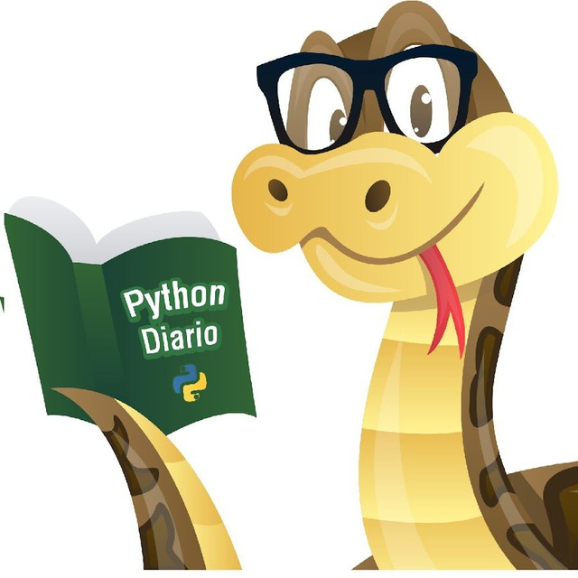

 
    <h1>
        
        Telegram-bot | yasha
    </h1>
    bot telegram:
    <a href="https://t.me/vidim_assistant_yashabot">https://t.me/vidim_assistant_yashabot</a>

Телеграм-бот для отслеживания статуса проверки домашней работы на Яндекс.Практикум.
Присылает сообщения, когда статус изменен - взято в проверку, есть замечания, зачтено.

### Технологии:
python-telegram-bot (v13.7)  
git: https://github.com/python-telegram-bot/python-telegram-bot

### Как запустить проект:

Клонировать репозиторий и перейти в него в командной строке:  

      git clone https://github.com/aoamosova/homework_bot.git
      cd homework_bot

Создать и активировать виртуальное окружение:

    python -m venv env  
    source env/bin/activate

Установить зависимости из файла requirements.txt:

    python -m pip install --upgrade pip
    pip install -r requirements.txt

Записать в переменные окружения (файл .env) необходимые ключи:

    токен профиля на Яндекс.Практикуме
    токен телеграм-бота
    свой ID в телеграме

Выполнить миграции:

    python manage.py migrate

Запустить проект:

    python manage.py runserver
